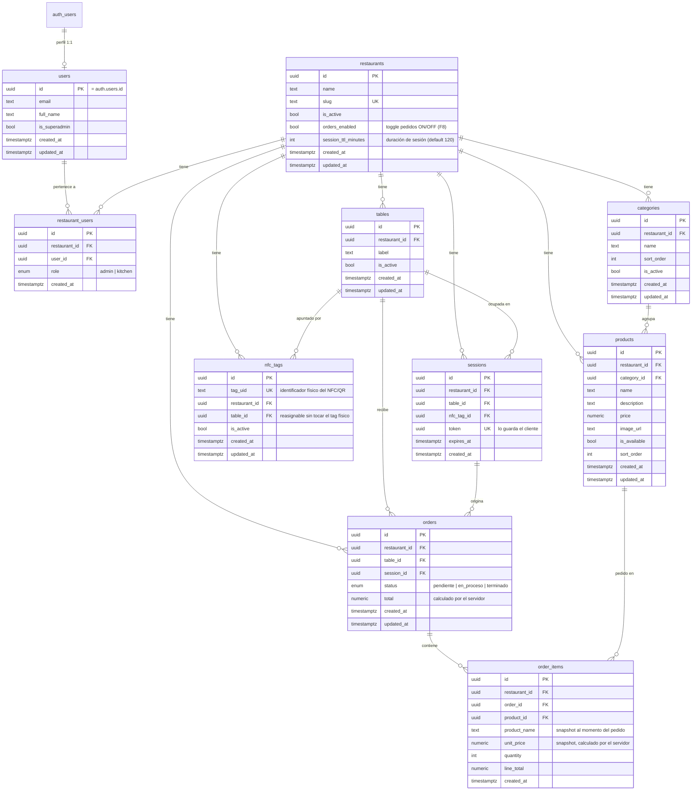

# Diagrama ER — final (Fase B7)

> Modelo de datos tal como quedó implementado, incluidas la seguridad (RLS) y las
> funciones. Coherente con `schema.sql` y las migraciones de `supabase/migrations/`.

## Notas de diseño

- **`auth_users`** representa `auth.users` de Supabase (no se crea ni se toca:
  la gestiona Supabase Auth). Nuestra tabla `users` es el perfil público 1:1.
- **`orders_enabled`** en `restaurants` es el toggle "Pedidos desde la mesa"
  ON/OFF del superadmin (Fase F8). El backend rechaza pedidos si está en `false`
  (Fase B3), aunque el cliente intente forzar la petición.
- **Integridad multi-tenant por FK compuesta**: `products` referencia
  `(restaurant_id, category_id)` → `categories(restaurant_id, id)`, y
  `order_items` referencia `(restaurant_id, product_id)` → `products(...)` y
  `(restaurant_id, order_id)` → `orders(...)`. Así la base rechaza, por ejemplo,
  meter en un pedido un producto de otro restaurante (test de Fase B1).
- **`sessions.token`** es lo que el cliente guarda tras resolver el NFC; con
  `expires_at` se controla la expiración (Fase B4).
- **Snapshots en `order_items`** (`product_name`, `unit_price`): si el admin
  cambia el precio o el nombre después, el pedido histórico no se altera.

## Capa de seguridad (RLS) — Fase B2

Todas las tablas tienen Row Level Security activo. Resumen de acceso:

- **Cliente (anon)**: lee solo restaurantes activos, y categorías/productos
  disponibles. No accede a pedidos, sesiones, mesas ni usuarios.
- **admin / kitchen**: acceden solo a los datos de su restaurante (aislamiento
  por `restaurant_users`). El admin edita el catálogo, mesas y tags.
- **superadmin** (`users.is_superadmin`): acceso global.
- Funciones ayudantes (SECURITY DEFINER): `is_superadmin()`,
  `is_restaurant_admin(uuid)`, `is_restaurant_staff(uuid)`.
- Trigger `handle_new_user`: crea el perfil en `users` al registrarse en Auth.

## Funciones RPC — Fases B3/B4

Escrituras sensibles pasan por funciones SECURITY DEFINER (el cliente no escribe
tablas directamente). Detalle de entradas/salidas en `api-rpc.md`.

- `resolve_nfc_tag(tag_uid)` → abre sesión al escanear (cliente).
- `create_order(session_token, items)` → crea el pedido; el total lo calcula el
  servidor (cliente).
- `set_order_status(order_id, status)` → cambia el estado (solo staff).
- `reassign_nfc_tag(tag_id, table_id)` → mueve un tag de mesa (solo admin).

## Realtime — Fase B5

`orders` y `order_items` transmiten cambios (INSERT/UPDATE) en tiempo real,
segmentados por restaurante mediante las mismas políticas RLS.
